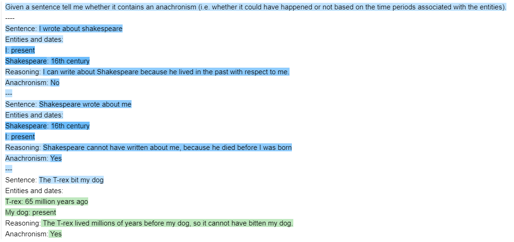

# Guidance

Guidance makes it easy to write prompts / programs to control language models with rich output structure.  
Simple output structure like [Chain of Thought](https://arxiv.org/abs/2201.11903) and its many variants (e.g. with [ART](https://arxiv.org/abs/2303.09014),) has been shown to improve LLM performance.  
The advent of more powerful LLMs like [GPT-4](https://arxiv.org/abs/2303.12712) allows for even richer output structure, and `guidance` makes that structure easier and cheaper.

# Install

```python
pip install guidance
```

# Quick demos
## Simple output structure
Let's take [a simple task](https://github.com/google/BIG-bench/tree/main/bigbench/benchmark_tasks/anachronisms) from BigBench, where the goal is to identify whether a given sentence contains an anachronism.  
Here is a simple two-shot prompt for it, with a human-crafted chain-of-thought sequence:
```python
import guidance
guidance.llm = guidance.llms.OpenAI("text-davinci-003") 
instruction = 'Given a sentence tell me whether it contains an anachronism (i.e. whether it could have happened or not based on the time periods associated with the entities).'
examples = [
    {'input': 'I wrote about shakespeare',
    'entities': [{'entity': 'I', 'time': 'present'}, {'entity': 'Shakespeare', 'time': '16th century'}],
    'reasoning': 'I can write about Shakespeare because he lived in the past with respect to me.',
    'answer': 'No'},
    {'input': 'Shakespeare wrote about me',
    'entities': [{'entity': 'Shakespeare', 'time': '16th century'}, {'entity': 'I', 'time': 'present'}],
    'reasoning': 'Shakespeare cannot have written about me, because he died before I was born',
    'answer': 'Yes'}
    ]
structure_prompt = guidance(
'''{{instruction}}
----
{{~! Few shot examples here ~}}
{{~#each examples}}
Sentence: {{this.input}}
Entities and dates:{{#each this.entities}}
{{this.entity}}: {{this.time}}{{/each}}
Reasoning: {{this.reasoning}}
Anachronism: {{this.answer}}
---
{{~/each}}
{{~! Input example here}}
Sentence: {{input}}
Entities and dates:
{{gen "entities"}}
Reasoning:{{gen "reasoning"}}
Anachronism:{{#select "answer"}} Yes{{or}} No{{/select}}''')
structure_prompt(examples=examples, input='The T-rex bit my dog', instruction=instruction)
```


We [compute accuracy](notebooks/anachronism.ipynb) on the validation set, and compare it to using the same two-shot examples above **without** the output structure, as well as to the best reported result [here](https://github.com/google/BIG-bench/tree/main/bigbench/benchmark_tasks/anachronisms). The results below agree with existing literature, in that even a very simple output structure drastically improves performance, even compared against much larger models.
| Model | Accuracy |
| :---: | :---: |
| [Few-shot learning with guidance examples, no CoT output structure](notebooks/anachronism.ipynb) | 63.04% |
| [PALM (3-shot)](https://github.com/google/BIG-bench/tree/main/bigbench/benchmark_tasks/anachronisms) | Around 69% |
| [Guidance](notebooks/anachronism.ipynb) | **76.01%** |


## Output structure with OpenAI's Chat models

